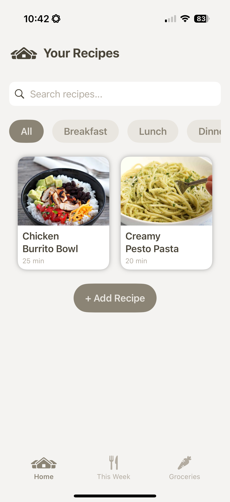
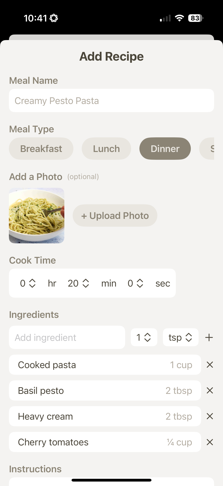
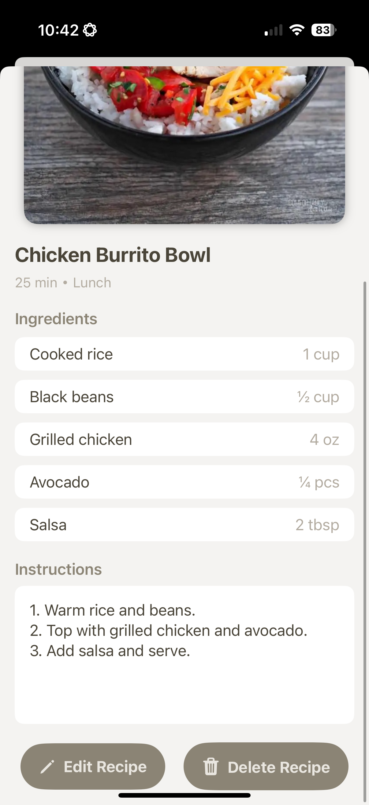
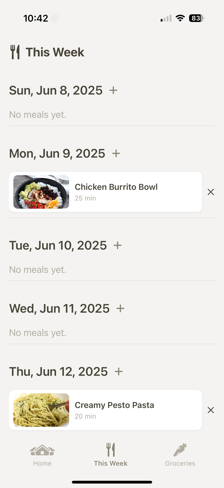
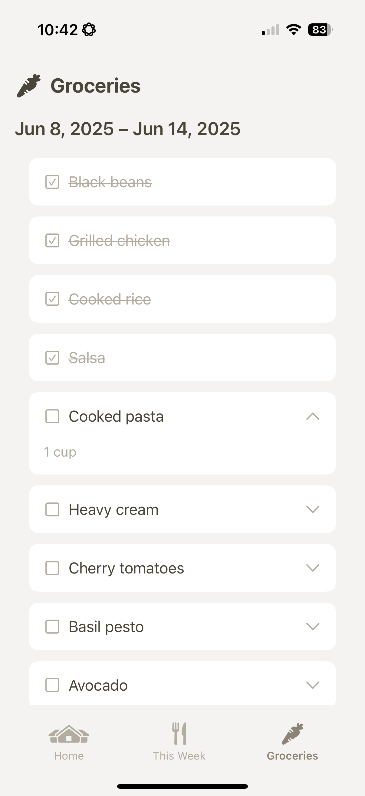

# CookLog

**CookLog** is a personal recipe and meal planning app built with SwiftUI and SwiftData. It allows users to store recipes, plan weekly meals, and generate grocery lists—all with a clean, user-friendly interface.

---

## Features

### Home View
- Displays all recipes in a grid layout using `LazyVGrid`.
- Includes:
  - **Search bar** to filter recipes by name.
  - **Meal type filter** (All, Breakfast, Lunch, Dinner, Snack).
  - **Add Recipe Button** to open the recipe creation sheet.
- Recipes update live when added or edited.

### Recipe Form View
- Add or edit a recipe with the following fields:
  - Name
  - Cook time (hours, minutes, seconds)
  - Optional photo (via `PhotosPicker`)
  - Meal type (single selection with custom capsule-style buttons)
  - Ingredients (with quantity and measurement unit)
  - Instructions
- Includes input validation for:
  - Empty name
  - Cook time of 0
  - At least one ingredient

### This Week View
- Displays the **7 days of the current week**, always rendered.
- Each day shows a `DailyMealSection` with:
  - Assigned meals for the day (if any)
  - Option to add a recipe to that day
  - Tap to view recipe details
- Automatic weekly reset logic:
  - Deletes previous week's meals and groceries if a new week is detected (using `UserDefaults` week identifier).

### Grocery List Integration
- Recipes can contribute ingredients to a shared grocery list (underlying model in `Groceries.swift`).
- Ingredients are tracked by name and quantity.

---

## Data & Persistence

- **SwiftData** handles all data persistence.
- `@Query` used in views like `HomeView` and `ThisWeekView` for live fetches.
- `modelContext.save()` and `.insert()` for manual state updates.
- Each model (e.g., `Recipe`, `WeeklyMeals`) conforms to SwiftData’s `PersistentModel`.

---

## Notable Implementation Notes

- `CustomButton` supports both **multi-select** (HomeView filters) and **single-select** (RecipeForm meal picker) behavior.
- Used `.sheet(item:)` for controlled modals when tapping a recipe or adding one to a day.
- `@Observable` and `@State` used to keep ViewModels reactive and connected to the UI.

## Screenshots

| Home View | Add Recipe |
|-----------|------------|
|  |  |

| Recipe Detail | Weekly View |
|---------------|-------------|
|  |  |

| Groceries View |
|----------------|
|  |

---

## Created By
**Rachael LaMassa**  
Portfolio Project – Summer 2025
